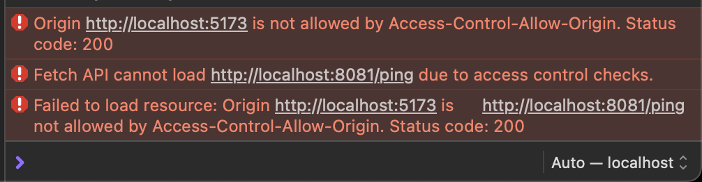

## fiber-cors-test

### Reproduction Steps

1. start fiber api server
```bash
go run app.go
```

2. start vite web server
```bash
npm install
npm run dev
```

3. navigate to web server address, click ping, and check dev console.

should see something similar to the screenshot below

